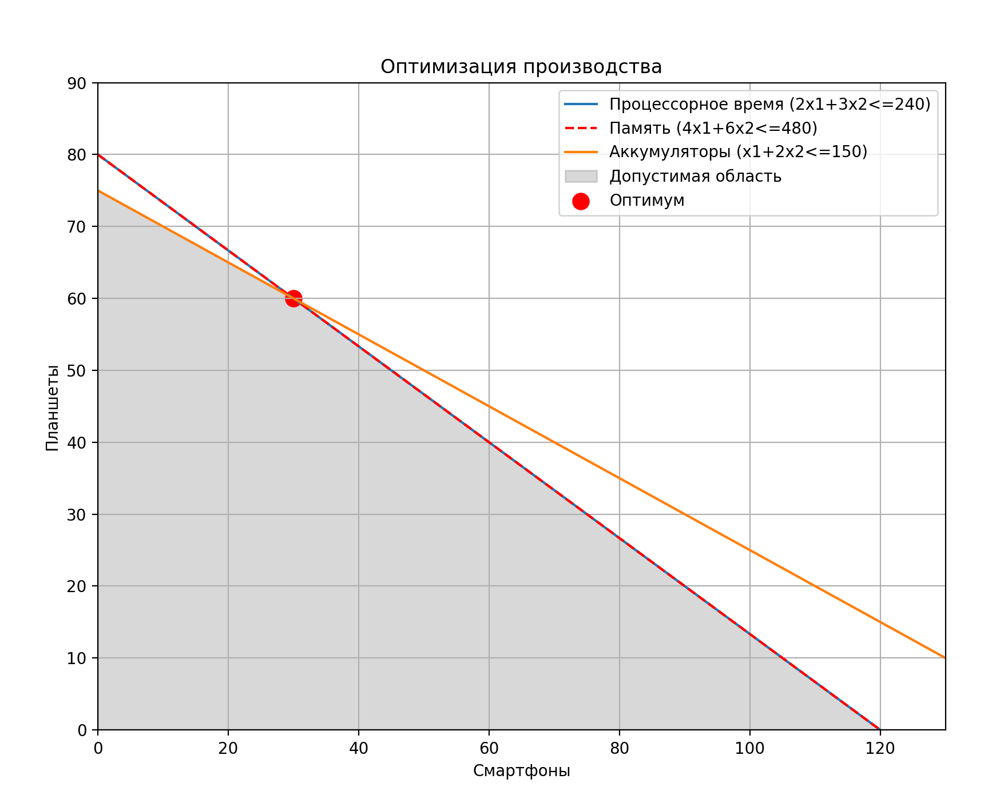
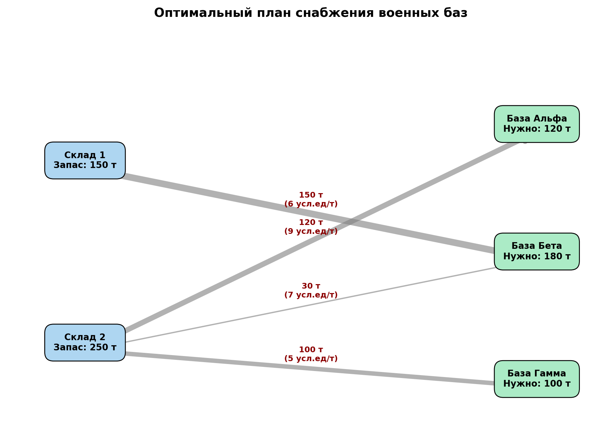

# Лабораторная работа - Линейное Программирование в Задачах Оптимизации
## Теоретическая часть  

Линейное программирование (ЛП) — это раздел математического программирования, посвященный поиску экстремумов (максимумов или минимумов) линейных целевых функций при наличии системы линейных ограничений.

Основные компоненты модели:

* Целевая функция: Линейная функция, значение которой необходимо максимизировать (например, прибыль) или 
минимизировать (затраты).

* Система ограничений: Линейные равенства или неравенства, определяющие область допустимых решений.

* Условия неотрицательности: Переменные решения обычно должны быть больше или равны нулю.

Для решения задач ЛП в Python используется модуль scipy.optimize, в частности функция linprog, реализующая симплекс-метод и методы внутренней точки.

## Задача 1

## Задача 2

