# Лабораторная работа №1
## Часть 1
[Результат](part1.py):

Вывод: Последовательное вычисление в одном потоке оказывается быстрее многопоточного решения на всех протестированных интервалах. Многопоточный подход в данном случае лишь увеличивает время выполнения за счёт накладных расходов на 
создание потоков, переключение контекста и использование механизмов синхронизации (Lock).
## Часть 2
Результат [1.1](part2/kod1.py):  
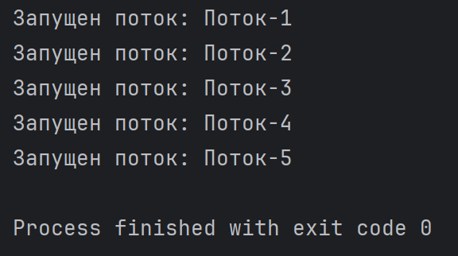  
Результат [1.2](part2/kod2.py):  
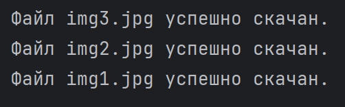  
Результат [1.3](part2/kod3.py):  
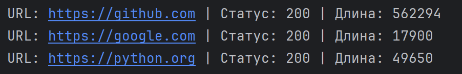  
Результат [1.4](part2/kod4.py):  
    
Результат [1.5](part2/kod5.py):  
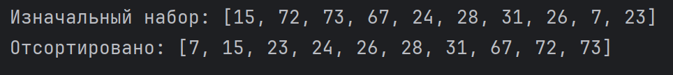  
## Часть 3
Результат [2.1](part3/kod1.py):  
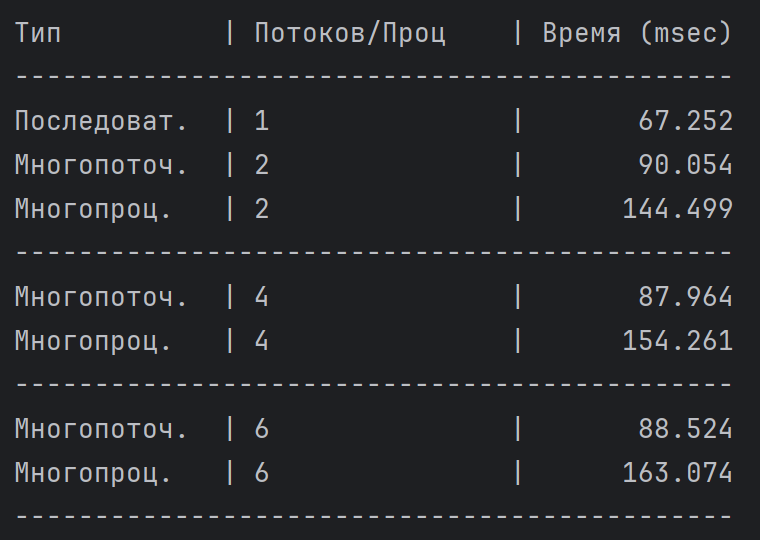  
Результат [2.2](part3/kod2.py):  
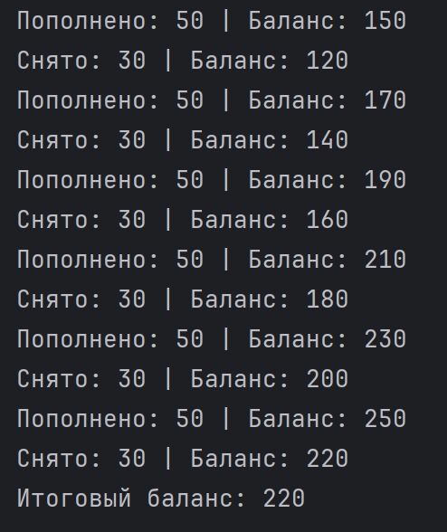  
Результат [2.3](part3/kod3.py):  
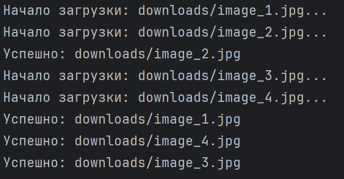  
Результат [2.4](part3/kod4.py):  
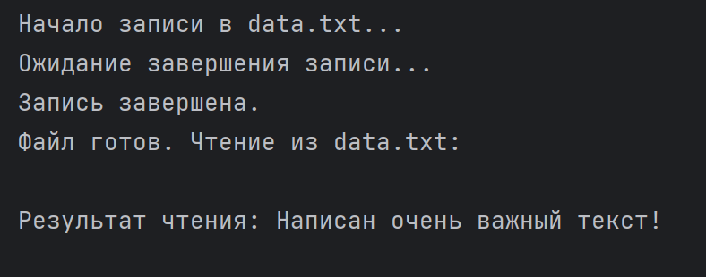  
Результат [2.5](part3/kod5.py):  
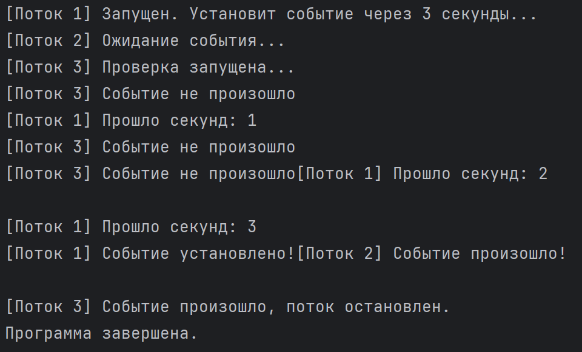  
Результат [2.6](part3/kod6.py):  
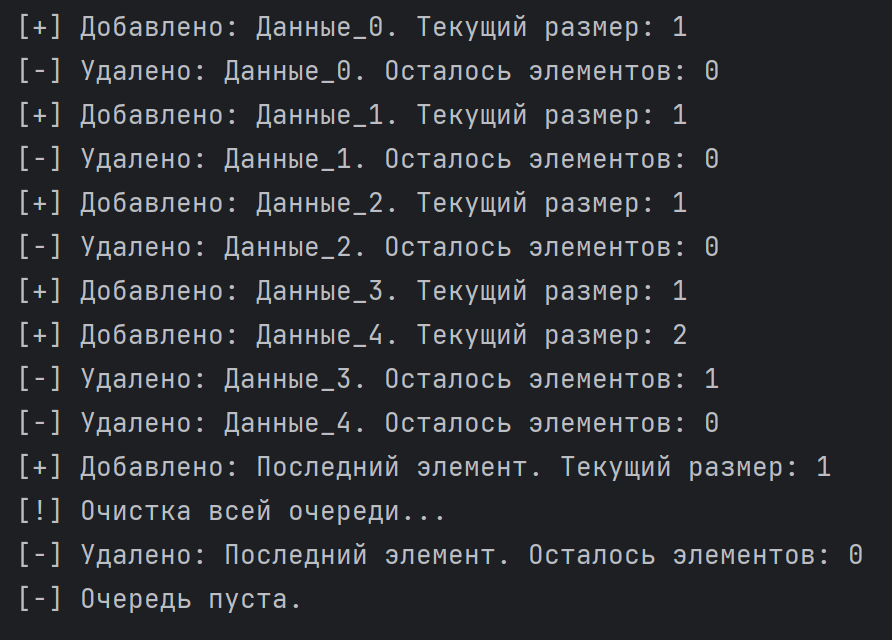  
Результат [2.7](part3/kod7.py):  
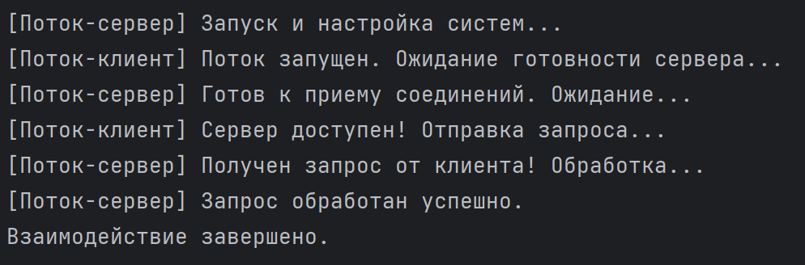  
Результат [2.8](part3/kod8.py):  
  