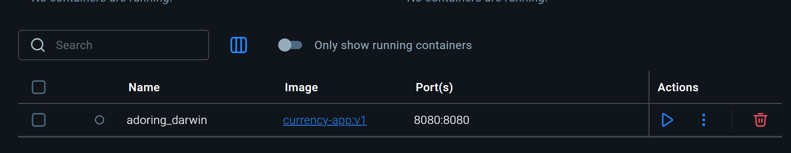
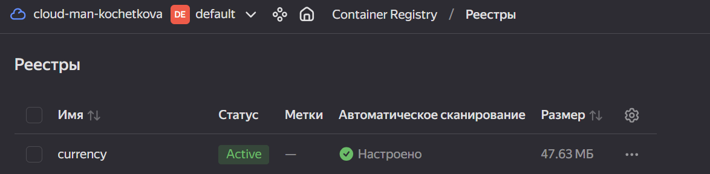
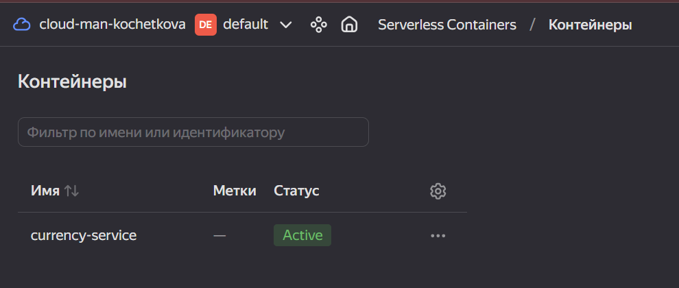

# Лабораторная работа №2
## Часть 1: Разработка микросервисов (Flask + Multiprocessing)  
Создание app.py
## Часть 2: Упаковка в Docker-контейнер  
Добавление фалов:
1. Создание requirements.txt
2. Создание Dockerfile

Сборка и проверка:

Соберка образа: docker build --platform linux/amd64 -t currency-app:v1 .  
Локальный запуск: docker run -p 8080:8080 currency-app:v1  
Проверка: 
1. Перейти в браузере на http://localhost:8080/api/rates.
2. Проверить наличие контейнера в Docker Desktop:     

## Часть 3: Развёртывание в Yandex Cloud  
1. Подготовка в Yandex Cloud  
    В консоли управления Yandex Cloud создать Container Registry (реестр для образов)  
    Установка Yandex Cloud CLI   
(iex (New-Object System.Net.WebClient).DownloadString('https://storage.yandexcloud.net/yandexcloud-yc/install.
   ps1'))  
    и авторизация (yc init)  
2. Настройка Yandex Container Registry    
    В консоли управления Yandex Cloud создать сервис Container Registry  
    Скопировать ID реестра  
    Авторизоваться в Docker (yc container registry configure-docker)    
3. Загрузка образа в облако  
    Тегирование: Заменить ID_РЕЕСТРА на скопированный ID:  
   (docker tag currency-app:v1 cr.yandex/ID_РЕЕСТРА/currency-app:v1)  
    Загрузка (docker push cr.yandex/ID_РЕЕСТРА/currency-app:v1)  
    Проверка загрузки в Yandex Cloud  

4. Развертывание в Serverless Containers
    В консоли Yandex Cloud создать контейнер (Serverless Containers)    
    В настройках важно:  
        Образ: выбрать currency-app:v1 из списка.  
        Сервисный аккаунт: создать или выбрать аккаунт с ролью container-registry.images.puller  

5. Проверка и HTTP-запросов  
[ссылка на развернутый на Yandex Cloud](https://bba8ookbdm87rk9d9il1.containers.yandexcloud.net/)  
[/api/rates](https://bba8ookbdm87rk9d9il1.containers.yandexcloud.net/api/rates)  
[/api/analytics](https://bba8ookbdm87rk9d9il1.containers.yandexcloud.net/api/analytics)  
[/api/convert](https://bba8ookbdm87rk9d9il1.containers.yandexcloud.net/api/convert)  