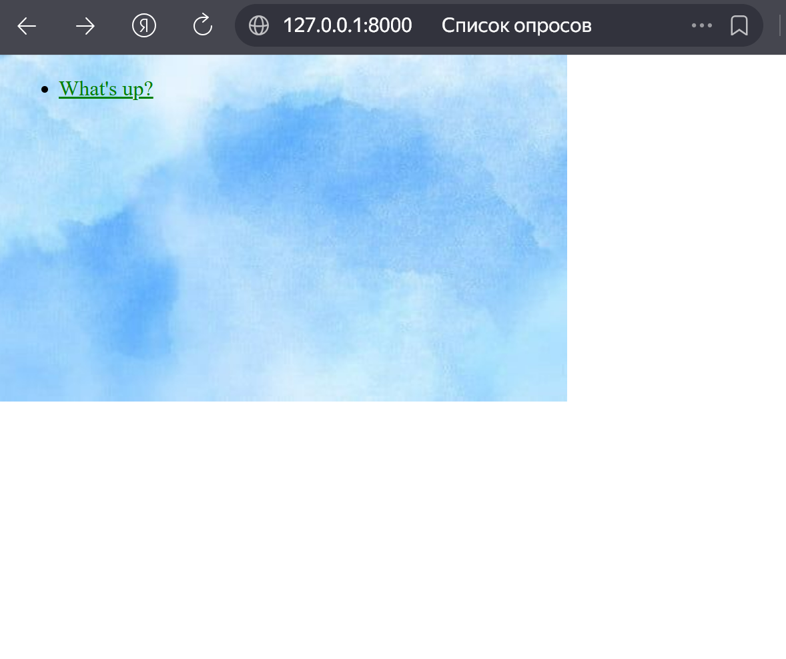
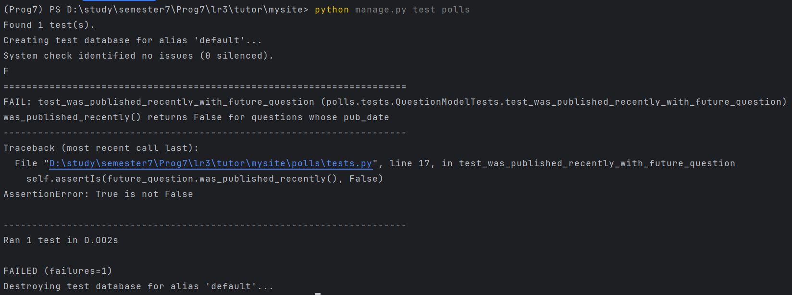

# Лабораторная работа №3

## 1. Подготовка и создание проекта

Создан каркас проекта и приложение:
```
django-admin startproject mysite
python manage.py startapp 
```

База данных инициализирована, создан суперпользователь для доступа к админке:

```
python manage.py migrate
python manage.py createsuperuser
```

## 2. Работа с моделями и БД

Описаны модели Question и Choice. Сгенерированы и применены миграции:

```
python manage.py makemigrations polls
python manage.py migrate
```


## 3. Интерфейс и логика (Views & Templates)

Реализованы представления (Index, Detail, Results) на базе Generic Views.

Настроена маршрутизация в urls.py.

Созданы HTML-шаблоны с использованием тегов Django.


## 4. Статические файлы и оформление

Подключены CSS-стили и фоновое изображение.

Результат: 



## 5. Тестирование 

Написаны автоматизированные тесты для проверки логики публикации.

Важный момент: при первом тестировании была выявленна ошибка

в последствии ошибка была исправленна

```
python manage.py test polls
```
## 6. Панель отладки (Debug Toolbar)

Установлена и интегрирована библиотека django-debug-toolbar.

Проведена коррекция MIDDLEWARE, INTERNAL_IPS и структуры HTML (добавлены теги <body>) для её активации.

