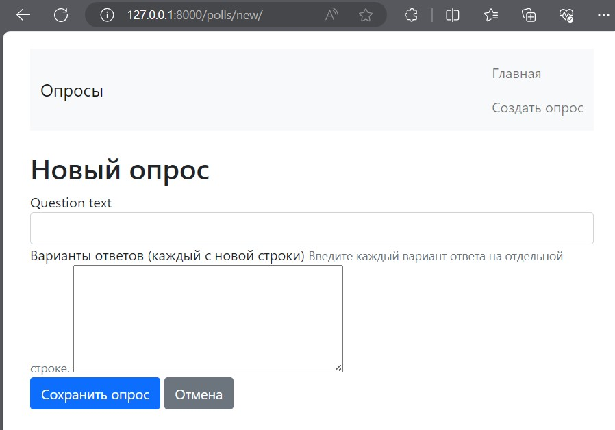
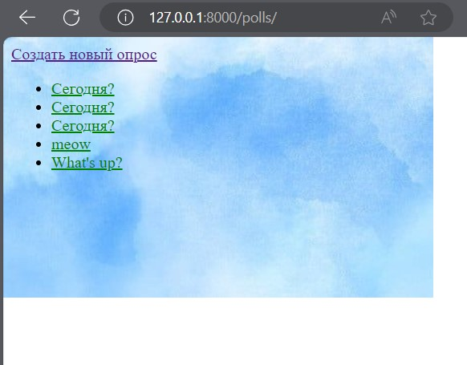
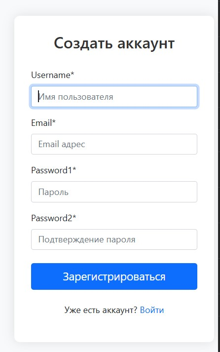
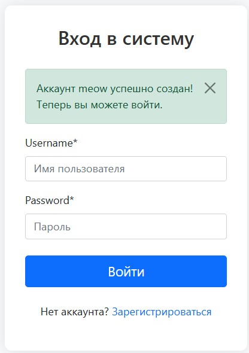
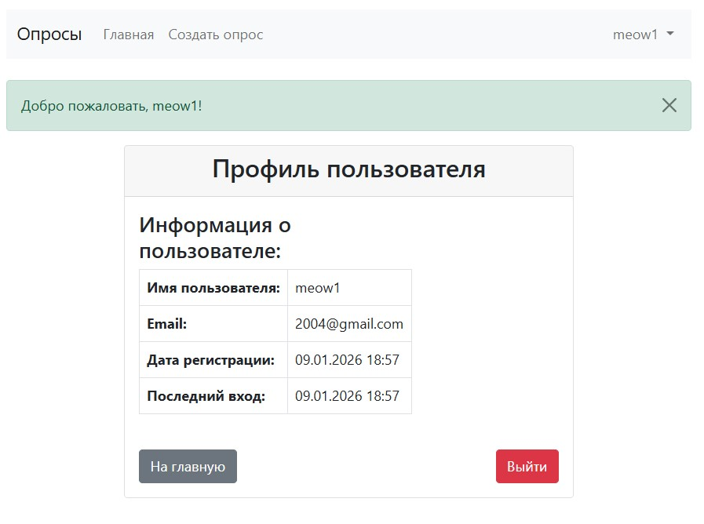

# Лабораторная работа №4

## Задача 1.1

1. Создание формы опроса (forms.py)

Создан файл формы для создания опросов с одним текстовым полем для вариантов:

[forms.py](tutor/mysite/polls/forms.py)

2. Изменение представления для новой формы.

* Добавлен импорт QuestionForm 
* Добавлен новое представление question_new

[views.py](tutor/mysite/polls/views.py)


3. Создание шаблона для формы

Создан файл question_edit.html

[question_edit.html](tutor/mysite/polls/templates/question_edit.html)




4. Добавление нового URL

```
path('new/', views.question_new, name='question_new')
```

[urls.py](tutor/mysite/polls/urls.py)

5. Добавление ссылки для создания опроса

Создана кнопка на главной странице опросов для создания нового опроса.



## Задача 1.2

1. Установить необходимые пакеты

```
pip install django-crispy-forms
pip install crispy-bootstrap5
```

2. Обновить settings.py

* Добавить crispy forms и шаблон для bootstrap 5
* Добавить настройки для crispy forms
* Добавить URL для перенаправления после логина/логаута

[settings.py](tutor/mysite/mysite/settings.py)

3. Создать приложение accounts

```
python manage.py startapp accounts
```

4. Добавить приложение в  settings.py

```
INSTALLED_APPS = [
    # ...
    'accounts.apps.AccountsConfig', 
    # ...
]
```

5. Создать файл accounts/forms.py

[forms.py](tutor/mysite/accounts/forms.py)

6. Создать представление

[views.py](tutor/mysite/accounts/views.py)

7. Создать шаблоны

* [base_auth.py](tutor/mysite/accounts/templates/accounts/base_auth.html)
* [register.py](tutor/mysite/accounts/templates/accounts/register.html)
* [login.py](tutor/mysite/accounts/templates/accounts/login.html)
* [profile.py](tutor/mysite/accounts/templates/accounts/profile.html)

8. Настройка URL

* Создать файл urls.py

[profile.py](tutor/mysite/accounts/urls.py)

* Добавить URL в главный urls.py

9. Обновить базовый шаюлон для отображения состояния пользовател

Результат:





