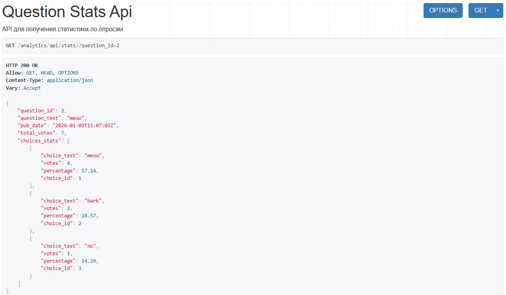
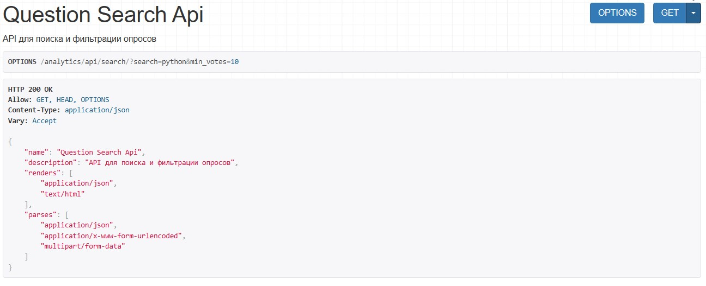
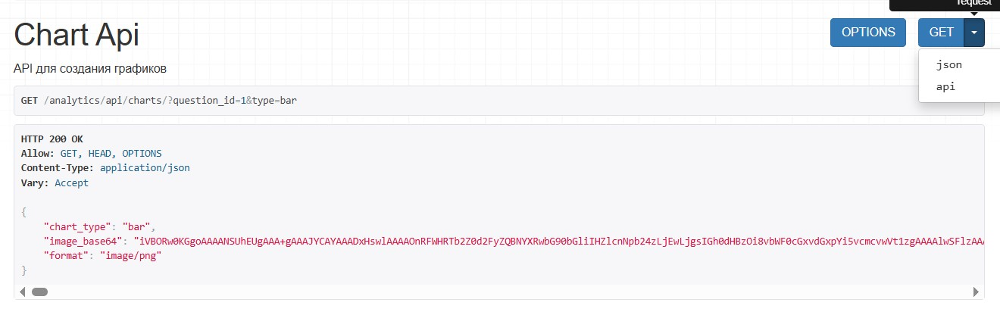
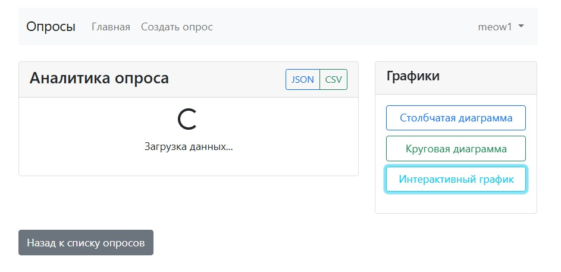

# Лабораторная работа №5

## Задача 1.1

1. Установка необходимых пакетов

```
pip install djangorestframework
pip install django-cors-headers
pip install matplotlib
pip install plotly
pip install pandas
```


2. Обновить файл settings.py

* Добавить новое приложение
* Добавить настройки REST Framework
* Добавить CORS настройки
* Дополнить MIDDLEWARE 


3. Создать приложение 

```
python manage.py startapp analytics
```

4. Настроить структура приложения

* [apps.py](tutor/mysite/analytics/apps.py)
* [serializers.py](tutor/mysite/analytics/serializers.py)
* [services.py](tutor/mysite/analytics/services.py)
* [views.py](tutor/mysite/analytics/views.py)
* [urls.py](tutor/mysite/analytics/urls.py)

5. Добавление в главный urls.py

[urls.py](tutor/mysite/mysite/urls.py)

6. Создание страницы поиска и аналитики в основном приложении

* Обновить [views.py](tutor/mysite/polls/views.py)
* Обновить [urls.py](tutor/mysite/polls/urls.py)

7. Создание шаблонов для фронтенда

* Создать [search.html](tutor/mysite/polls/templates/polls/search.html)
* Создать [analytics.html](tutor/mysite/polls/templates/polls/analytics.html)

8. Создание JavaScript для фронтенда

* Создать [search.js](tutor/mysite/polls/static/polls/js/search.js)
* Создать [analytics.js](tutor/mysite/polls/templates/polls/js/analytics.js)

Результат:







